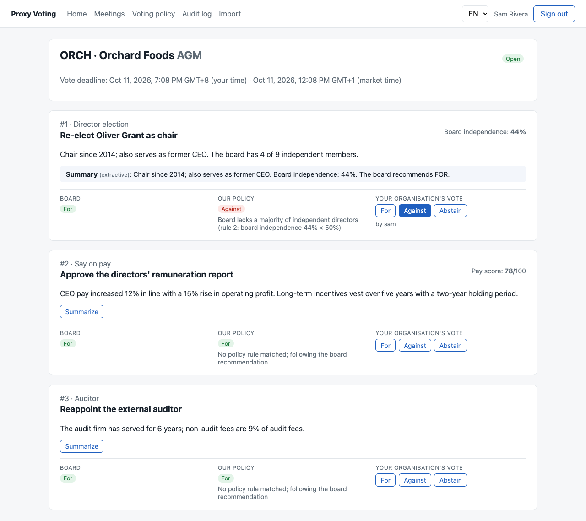

# App 2: Proxy Voting Tracker

Companion project: [payroll-platform](https://github.com/nearbyjustine/payroll-platform) · Both share the [concepts handbook](docs/handbook/README.md).

Spring Boot 4.1 · Java 21 · PostgreSQL + Flyway · Keycloak (multi-tenant OIDC) · S3 + Lambda + SQS on LocalStack · Claude API · Vue 3

Institutional investors track shareholder meetings, get vote recommendations generated from **their own**
voting policy (a Specification-pattern rules engine), and vote before deadlines in different markets' time zones,
with an append-only audit trail. Meeting data arrives through an event-driven pipeline:
**CSV upload → S3 → Lambda → SQS (+ DLQ) → API**.
Plan: [docs/PLAN.md](docs/PLAN.md) · Concepts: [docs/handbook](docs/handbook/README.md)



All data is synthetic. This is a learning project in the corporate-governance domain and is not affiliated with any company.

## Run it

```bash
cd lambda && ./mvnw package && cd ..          # the Lambda jar LocalStack deploys on startup
docker compose up -d                           # Postgres :5433, Keycloak :8280, LocalStack :4567 (S3, SQS+DLQ, Lambda, trigger)

cd backend && ./mvnw spring-boot:run           # http://localhost:8080 (or run the full profile below)
cd frontend && npm install && npm run dev      # http://localhost:5174

# everything in containers (API :8090, web :8091)
cd backend && ./mvnw -DskipTests package && cd ..
docker compose --profile full up -d --build
```

Optional: `export ANTHROPIC_API_KEY=...` to summarize proposals with Claude (`claude-opus-5`, low effort, server-side
refusal fallback). Without a key the app uses an offline extractive summarizer.

| User | Password | Organisation | Roles |
|---|---|---|---|
| sam | sam123 | Stewardship Pension Fund | ANALYST, VOTER, POLICY_ADMIN, OPS |
| vic | vic123 | Stewardship Pension Fund | VOTER |
| gina | gina123 | Growth Capital Partners | ANALYST, VOTER, POLICY_ADMIN |

Try the pipeline: sign in as `sam` → Import → upload `sample-data/harbor-logistics.csv` → the meeting appears in a few seconds.

## Test it

```bash
cd lambda && ./mvnw test         # CSV parsing (quotes, BOM, CRLF) and row validation
cd backend && ./mvnw test        # 17 tests incl. Testcontainers: SQS import, duplicate delivery, poison message -> DLQ
cd frontend && npm test
cd e2e && npm install && npm test   # browser: 3 users, voting, policy, CSV upload end to end
```

## Highlights (where to look)

| Concept | Code |
|---|---|
| Specification pattern rules engine, first match wins | `backend/.../policy/ProposalCondition`, `PolicyRule`, `PolicyEngine` |
| Tenant from JWT claim, never from the request | `config/Tenant`, `common/CurrentUser.orgCode` |
| Idempotent SQS consumer + DLQ | `ingest/SqsMeetingConsumer`, `MeetingImportService`, `infra/localstack/init.sh` |
| Java Lambda: S3 event → SQS batch | `lambda/src/main/java/dev/justine/ingest/MeetingIngestHandler` |
| Deadlines as instants, displayed per market time zone | `meeting/DeadlineStatus`, `frontend/src/utils/time.ts` |
| Same-transaction, append-only audit trail | `audit/AuditService`, `AuditEvent` |
| AI behind a port, with fallback | `ai/ProposalSummarizer`, `ClaudeProposalSummarizer`, `ExtractiveSummarizer` |
| Pre-signed PUT: browser uploads straight to S3 | `ingest/IngestController`, `frontend/src/views/IngestView.vue` |
